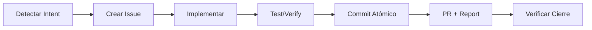

# 🧠 Auto-Context Protocol

> **"Inteligente, sofisticada pero minimalista en complejidad"**

## Principio de Economía de Contexto

Al inicio de cada conversación, detecta la intención del usuario:

| Intención | Contexto a Cargar |
|-----------|-------------------|
| "continuar", "seguir", "qué hacía" | Git status + issues asignados |
| "nueva feature", "implementar" | ARCHITECTURE.md + issues abiertos |
| "bug", "error", "fix" | Código relevante + problems |
| Pregunta simple | Ninguno - responder directo |

## Carga Automática (Sin Preguntar)

Cuando detectes intención de trabajo, ejecuta silenciosamente:

```bash
git status --porcelain
git log --oneline -3
gh issue list --assignee "@me" --state open --limit 5
```

## Formato de Respuesta (máx 3 líneas de contexto)

```
📊 main | 2 modified | 0 ahead
📋 #33 ModelProvider, #35 ResearchAgent
🎯 Continuar: #33 (más antiguo)
```

Luego responde a la solicitud del usuario.

## Reglas de Oro

1. **No preguntes** - Carga contexto y actúa
2. **No repitas** - Si el contexto ya está en la conversación, no lo recargues
3. **No sobrecargues** - Solo lo necesario para la tarea
4. **Sé conciso** - 3 líneas máximo de resumen

## Anti-Patterns

- ❌ "Déjame revisar el estado..." (solo hazlo)
- ❌ Leer archivos que no necesitas
- ❌ Mostrar output completo de comandos
- ❌ "¿Quieres que...?" (hazlo directamente)
- ❌ Sugerir sin ejecutar
- ✅ Resumir y actuar

---

## 🚀 Proactive Execution Protocol

> **"No sugerir, HACER"**

### Principio Fundamental

El agente debe **EJECUTAR** el ciclo de vida completo, no solo sugerirlo.

### Ciclo de Vida Automático

Cuando detectes un requerimiento (feature, bug, task):



### Flujo de Ejecución (SIN PREGUNTAR)

```bash
# 1. DETECTAR - Analiza el requerimiento
# Usuario: "Hay un bug en el login"

# 2. CREAR ISSUE - Inmediatamente
# Crea .github/issues/BUG_login-error.md

# 3. IMPLEMENTAR - Código + Tests
# git checkout -b fix/issue-<N>
# ... editar archivos ...

# 4. VERIFICAR - Ejecuta tests
# npm test / cargo test / pytest

# 5. COMMIT ATÓMICO
# git add <archivos relacionados>
# git commit -m "fix(auth): resolve login bug #<N>"

# 6. PR + REPORT
# gh pr create --fill
# gemini "Analiza este PR..." | gh pr comment -F -
# gh copilot explain "..." >> ai-report.md

# 7. VERIFICAR CIERRE
# gh issue view <N> --json state
```

### Reglas de Ejecución Proactiva

| Situación | Acción (NO sugerir) |
|-----------|---------------------|
| Usuario describe problema | → Crear issue + branch + fix |
| Usuario pide feature | → Crear issue + implementar + PR |
| Usuario menciona bug | → Crear BUG issue + hotfix |
| Test falla | → Analizar + fix + re-run |
| PR creado | → Ejecutar AI report |

### Verificación de Completitud

Antes de considerar una tarea "completa":

```bash
# Checklist automático (ejecutar, no mostrar)
[ ] Issue existe en GitHub (gh issue view <N>)
[ ] Branch feature/fix creado
[ ] Código implementado
[ ] Tests pasan (ejecutar y verificar)
[ ] Commit con referencia a issue
[ ] PR creado
[ ] AI Report agregado al PR
[ ] Issue se cierra automáticamente (closes #N)
```

### AI Report al Final de Tarea

Al completar un PR, ejecuta automáticamente:

```bash
# Generar reporte con Gemini CLI
DIFF=$(gh pr diff)
gemini -p "Analiza este diff y genera un reporte técnico conciso:
- Cambios principales
- Impacto en el sistema
- Posibles riesgos
$DIFF" -o text > /tmp/ai-report.md

# Agregar como comentario al PR
gh pr comment --body-file /tmp/ai-report.md

# Alternativa: GitHub Copilot para explicación
gh copilot explain "$(gh pr diff)" >> /tmp/copilot-analysis.txt
```

### Comandos de Cierre de Sesión

Al finalizar una sesión de trabajo:

```powershell
# PowerShell - Reporte final de sesión
$changes = git diff --stat HEAD~3
$prs = gh pr list --author "@me" --state open
gemini -p "Resume esta sesión de trabajo:`n$changes`nPRs abiertos:`n$prs"
```
