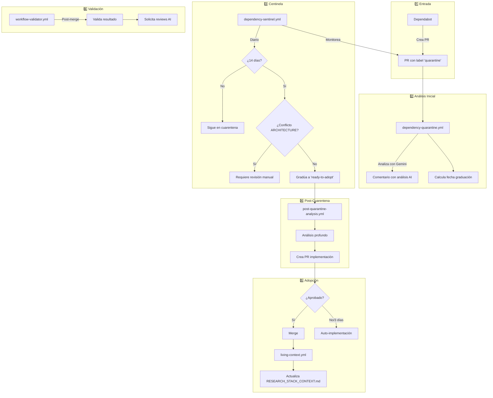

github_issue: 47

## 📋 Descripción

Documentar el sistema completo de workflows para manejo de dependencias siguiendo el protocolo Git-Core.

## 🏗️ Arquitectura del Sistema

## 📊 Workflows Involucrados

| Workflow | Función | Trigger |
|----------|---------|---------|
| `dependency-sentinel.yml` | 🛡️ **Cerebro central** - Orquesta todas las decisiones | PRs, schedule, workflow_run |
| `dependency-quarantine.yml` | 🔬 Análisis inicial con AI | PRs de Dependabot |
| `post-quarantine-analysis.yml` | 🔓 Análisis post-14 días | Schedule, workflow_call |
| `living-context.yml` | 🌐 Actualiza documentación | PRs mergeados, schedule |
| `workflow-validator.yml` | 🔬 Meta-validación | workflow_run |

## ✅ Tareas

- [ ] Añadir diagrama de flujo al README
- [ ] Crear sección en AGENTS.md sobre el Sentinel
- [ ] Documentar variables de entorno configurables
- [ ] Añadir ejemplos de uso manual

---
github_issue: 47

*Generado por análisis del sistema de workflows*
