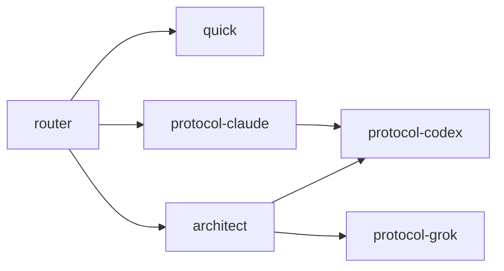

# 🤖 AGENTS.md - AI Agent Configuration

> **"Inteligente, sofisticada pero minimalista en complejidad"**

## Overview

This repository follows the **Git-Core Protocol** for AI-assisted development.

---

## 🚀 Git-Core v2.1 (12-Factor Agents + ACP Patterns)

**Implementación avanzada de lógicas "12-Factor Agents", "HumanLayer" y "Agent Control Plane":**

### 1. Context Protocol (Stateless Reducer) ⭐ UPDATED

Los agentes deben persistir su estado en los Issues usando bloques XML `<agent-state>`.

**Campos v2.1:**
| Campo | Descripción |
|-------|-------------|
| `<intent>` | Objetivo de alto nivel |
| `<step>` | Estado actual (`planning`, `coding`, `waiting_for_input`) |
| `<plan>` | **NEW:** Lista de tareas dinámica (items con `done`/`in_progress`/`pending`) |
| `<input_request>` | **NEW:** Solicitud de datos al humano (Human-as-Tool) |
| `<metrics>` | **NEW:** Telemetría (`tool_calls`, `errors`, `cost_estimate`) |
| `<memory>` | Datos JSON para retomar el trabajo |

👉 **Ver especificación completa:** `docs/agent-docs/CONTEXT_PROTOCOL.md`

**Helper Script:**
```bash
# Leer estado desde un Issue
./scripts/agent-state.ps1 read -IssueNumber 42

# Generar bloque XML
./scripts/agent-state.ps1 write -Intent "fix_bug" -Step "coding" -Progress 50
```

### 2. Micro-Agents (Personas)

Los agentes deben adoptar roles específicos basados en las etiquetas (Labels) del Issue.

| Label | Persona | Foco |
|-------|---------|------|
| `bug` | 🐛 The Fixer | Reproducir y corregir |
| `enhancement` | ✨ Feature Dev | Arquitectura primero |
| `high-stakes` | 👮 The Approver | Require "Proceder" |

👉 **Ver especificación:** `docs/agent-docs/MICRO_AGENTS.md`

### 3. High Stakes Operations (Human-in-the-Loop)

Para operaciones críticas (borrar datos, deploys, cambios de auth), el agente **DEBE PAUSAR** y solicitar confirmación explícita:
> "⚠️ Esta es una operación de alto riesgo. Responde **'Proceder'** para continuar."

👉 **Ver especificación:** `docs/agent-docs/HUMAN_LAYER_PROTOCOL.md`

---

## ⛔ FORBIDDEN FILES (HARD RULES)

**NEVER create these files under ANY circumstances:**

### Task/State Management

```
❌ TODO.md, TASKS.md, BACKLOG.md
❌ PLANNING.md, ROADMAP.md, PROGRESS.md
❌ NOTES.md, SCRATCH.md, IDEAS.md
❌ STATUS.md, CHECKLIST.md, CHANGELOG.md (for tracking)
```

### Testing/Implementation Summaries

```
❌ TESTING_CHECKLIST.md, TEST_PLAN.md, TEST_GUI.md
❌ IMPLEMENTATION_SUMMARY.md, IMPLEMENTATION.md
❌ SUMMARY.md, OVERVIEW.md, REPORT.md
```

### Guides/Tutorials

```
❌ GETTING_STARTED.md, GUIDE.md, TUTORIAL.md
❌ QUICKSTART.md, SETUP.md, HOWTO.md
❌ INSTRUCTIONS.md, MANUAL.md
```

### Catch-all

```
❌ ANY .md file for task/state management
❌ ANY .md file for checklists or summaries
❌ ANY .md file for guides or tutorials
❌ ANY .txt file for notes or todos
❌ ANY JSON/YAML for task tracking
```

### ✅ ONLY ALLOWED `.md` FILES

```
✅ README.md (project overview ONLY)
✅ AGENTS.md (agent configuration ONLY)
✅ .✨/ARCHITECTURE.md (system architecture ONLY)
✅ CONTRIBUTING.md, LICENSE.md (standard repo files)
✅ docs/prompts/*.md (session continuation prompts - SCRIPT GENERATED ONLY)
```

### 📤 Session Continuation Prompts (NEW)

When you need to export context for a new chat session:

| Rule | Description |
|------|-------------|
| **MUST** be generated by script | `./scripts/export-session.ps1` |
| **MUST** follow naming | `SESSION_{date}_{topic}.md` |
| **SHOULD** be deleted after use | Not permanent documentation |
| **CANNOT** be manually created | Script enforces structure |

**Workflow:**

```bash
# Generate continuation prompt
./scripts/export-session.ps1 -Topic "feature-name" -Summary "Current progress..."

# In new chat, reference the file:
# User types: #file:docs/prompts/SESSION_2025-01-15_feature-name.md
```

**🚨 STOP! Before creating ANY document, ask yourself:**
> "Can this be a GitHub Issue?" → **YES. Always yes. Create an issue.**
> "Can this be a comment in an existing issue?" → **YES. Add a comment.**
> "Is this a summary/checklist/guide?" → **NO. Use GitHub Issues or comments.**

---

## For All AI Agents (Copilot, Cursor, Windsurf, Claude, etc.)

### 🎯 Prime Directive: Token Economy

```
Your state is GitHub Issues. Not memory. Not files. GitHub Issues.
```

### 📖 Required Reading Before Any Task

1. `.✨/ARCHITECTURE.md` - Understand the system
2. `gh issue list --assignee "@me"` - Your current task
3. `gh issue list --limit 5` - Available backlog

---

## 🛡️ Architecture Verification Rule (MANDATORY)

**BEFORE implementing ANY infrastructure/tooling:**

1. Read `.✨/ARCHITECTURE.md` CRITICAL DECISIONS section
2. Verify your implementation matches the decided stack
3. If issue mentions alternatives, ARCHITECTURE.md decision wins

### Example of what NOT to do

- Issue says: "Deploy to Vercel or GitHub Pages"
- ARCHITECTURE.md says: "Hosting: GitHub Pages"
- ❌ WRONG: Implement Vercel because issue mentioned it
- ✅ CORRECT: Use GitHub Pages (architecture decision)

**Why?** Architecture decisions are made after careful consideration of project constraints. Issues may present options for discussion, but once a decision is recorded in ARCHITECTURE.md, it is final.

**Related Documentation:**

- `.✨/ARCHITECTURE.md` - CRITICAL DECISIONS table
- `.github/copilot-instructions.md` - Architecture First Rule

---

## 🔄 The Loop (Workflow)

### Phase 0: HEALTH CHECK (Anthropic Pattern - OBLIGATORIO)

> ⚠️ **ANTES de implementar cualquier feature nuevo, verificar salud del proyecto.**
>
> Inspirado por: [Anthropic's "Effective harnesses for long-running agents"](https://www.anthropic.com/engineering/effective-harnesses-for-long-running-agents)

```bash
# 1. Orientación básica
pwd                              # Confirmar directorio de trabajo

# 2. Estado del proyecto
git log --oneline -10            # Ver trabajo reciente
cat .✨/features.json            # Ver features y su estado (passes: true/false)

# 3. Ejecutar tests existentes
npm test                         # o: cargo test, pytest, etc.
# Si hay FALLOS → ARREGLAR PRIMERO (prioridad máxima)
# Si PASAN → Continuar a Phase 1

# 4. Verificación E2E (si aplica)
# Iniciar dev server y verificar funcionalidad básica
npm run dev &
# curl http://localhost:3000/health || exit 1
```

**Regla de Oro (Anthropic):**
> "If the agent had started implementing a new feature [with existing bugs], it would likely make the problem worse."

### Phase 1: READ (Context Loading)

```bash
# 1. Arquitectura y decisiones críticas
cat .✨/ARCHITECTURE.md

# 2. Estado del agente en el issue asignado
gh issue list --assignee "@me" --state open
gh issue view <id> --comments | grep -A 50 '<agent-state>'

# 3. Research context para dependencias
cat docs/agent-docs/RESEARCH_STACK_CONTEXT.md

# 4. Elegir feature de mayor prioridad que NO esté completado
# (Revisar .✨/features.json → passes: false)
```

### Phase 2: ACT (Development)

```bash
# Claim a task
gh issue edit <ISSUE_NUMBER> --add-assignee "@me"

# Create feature branch
git checkout -b feat/issue-<ISSUE_NUMBER>

# Write code + tests
# ...

# Commit with Conventional Commits
git add .
git commit -m "feat(scope): description (closes #<ISSUE_NUMBER>)"
```

### Phase 3: UPDATE (Close the Loop)

```bash
# Push and create PR
git push -u origin HEAD
gh pr create --fill --base main

# Generate AI Report (NUEVO)
./scripts/ai-report.ps1  # Windows
./scripts/ai-report.sh   # Linux/macOS

# DO NOT manually close issues - let Git do it via commit message
```

---

## 🚀 Proactive Execution Protocol (NUEVO)

> **"No sugerir, HACER"**

El agente debe **EJECUTAR** el ciclo de vida completo, no solo sugerirlo.

### Ciclo de Vida Automático

```mermaid
graph LR
    A[Detectar Intent] --> B[Crear Issue]
    B --> C[Implementar]
    C --> D[Test/Verify]
    D --> E[Commit Atómico]
    E --> F[PR + AI Report]
    F --> G[Verificar Cierre]
```



### Reglas de Ejecución Proactiva

| Situación | Acción (NO sugerir) |
|-----------|---------------------|
| Usuario describe problema | → Crear issue + branch + fix |
| Usuario pide feature | → Crear issue + implementar + PR |
| Usuario menciona bug | → Crear BUG issue + hotfix |
| Test falla | → Analizar + fix + re-run |
| PR creado | → Ejecutar AI report |

### AI Report al Final de Tarea

Al completar un PR, ejecutar automáticamente:

```powershell
# Generar análisis con Gemini y Copilot
./scripts/ai-report.ps1 -PrNumber <N>

# Solo Gemini
./scripts/ai-report.ps1 -ReportType gemini

# Preview sin publicar
./scripts/ai-report.ps1 -DryRun
```

### Anti-Patterns de Ejecución

| ❌ NO hacer | ✅ SÍ hacer |
|-------------|-------------|
| "¿Quieres que cree un issue?" | → Crear el issue directamente |
| "Deberías ejecutar los tests" | → Ejecutar los tests |
| "Puedes crear un PR con..." | → Crear el PR |
| "Te sugiero agregar..." | → Agregar el código |

---

## 📁 File-Based Issue Management (RECOMMENDED)

**Alternativa a `gh issue create`: Crea issues usando archivos .md**

### Ubicación

```
.github/issues/
├── _TEMPLATE.md              # Template para nuevos issues
├── .issue-mapping.json       # Mapeo automático archivo↔issue
├── FEAT_mi-feature.md        # Issue de feature
├── BUG_fix-login.md          # Issue de bug
└── TASK_update-deps.md       # Issue de tarea
```

### Formato de Archivo

```markdown
---
title: "Título del Issue"
labels:
  - ai-plan
  - enhancement
assignees: []
---

## Descripción

Contenido del issue...
```

### Workflow

```bash
# 1. Crear archivo en .github/issues/
# Usa el formato: TYPE_descripcion.md
# Types: FEAT, BUG, TASK, DOCS, REFACTOR, TEST, CHORE

# 2. Sincronizar con GitHub (local)
./scripts/sync-issues.ps1      # Windows
./scripts/sync-issues.sh       # Linux/macOS

# 3. O dejar que el workflow lo haga automáticamente
# El workflow sync-issues.yml se ejecuta en cada push
```

### Comandos del Script

```bash
# Sync completo (crear + limpiar)
./scripts/sync-issues.ps1

# Solo crear issues desde .md
./scripts/sync-issues.ps1 -Push

# Solo eliminar archivos de issues cerrados
./scripts/sync-issues.ps1 -Pull

# Modo watch (sincroniza cada 60s)
./scripts/sync-issues.ps1 -Watch

# Dry run (ver qué haría sin ejecutar)
./scripts/sync-issues.ps1 -DryRun
```

### Ventajas

| Método | Ventaja |
|--------|---------|
| **Archivos .md** | Versionados en Git, fácil edición en IDE |
| **gh issue create** | Rápido para issues simples |
| **GitHub UI** | Visual, templates automáticos |

### Auto-Limpieza

Cuando un issue se **cierra** en GitHub:

1. El workflow detecta el cierre
2. Elimina el archivo `.md` correspondiente
3. Actualiza el mapeo

**Resultado:** Solo existen archivos para issues **abiertos**.

---

## 🚫 Anti-Patterns (NEVER DO THIS)

| ❌ Don't | ✅ Do Instead |
|----------|---------------|
| Create TODO.md files | Use `gh issue create` |
| Create PLANNING.md | Use `gh issue create` with label `ai-plan` |
| Create PROGRESS.md | Use `gh issue comment <id> --body "..."` |
| Create NOTES.md | Add notes to relevant issue comments |
| Track tasks in memory | Query `gh issue list` |
| Write long planning docs | Create multiple focused issues |
| Forget issue references | Always include `#<number>` in commits |
| Close issues manually | Use `closes #X` in commit message |
| Create any .md for tracking | **ALWAYS use GitHub Issues** |

---

## ✅ What You CAN Create

| ✅ Allowed | Purpose |
|------------|----------|
| Source code (`.py`, `.js`, `.ts`, etc.) | The actual project |
| Tests (in `tests/` folder) | Quality assurance |
| Config files (docker, CI/CD, linters) | Infrastructure |
| `.✨/ARCHITECTURE.md` | System architecture (ONLY this file) |
| `README.md` | Project documentation |
| `docs/agent-docs/*.md` | **ONLY when user explicitly requests** |
| GitHub Issues | **EVERYTHING ELSE** |

---

## 📄 User-Requested Documentation (agent-docs)

When the user **explicitly requests** a persistent document (prompt, research, strategy, etc.):

```bash
# Create in docs/agent-docs/ with proper prefix
# Prefixes: PROMPT_, RESEARCH_, STRATEGY_, SPEC_, GUIDE_, REPORT_, ANALYSIS_

# Example: User says "Create a prompt for Jules"
docs/agent-docs/PROMPT_JULES_AUTH_SYSTEM.md

# Commit with docs(agent) scope
git commit -m "docs(agent): add PROMPT for Jules auth implementation"
```

**✅ ONLY create files when user says:**

- "Save this as a document"
- "Create a prompt file for..."
- "Document this strategy"
- "Write a spec for..."
- "I need this as a reference"

**❌ DO NOT create files, just respond in chat:**

- "Explain how to..."
- "Summarize this..."
- "What's the best approach..."

---

## 🏷️ YAML Frontmatter Meta Tags (REQUIRED for agent-docs)

When creating documents in `docs/agent-docs/`, **ALWAYS** include YAML frontmatter for rapid AI scanning:

```yaml
---
title: "Authentication System Prompt"
type: PROMPT
id: "prompt-jules-auth"
created: 2025-11-29
updated: 2025-11-29
agent: copilot
model: claude-opus-4
requested_by: user
summary: |
  Prompt for Jules to implement OAuth2 authentication
  with Google and GitHub providers.
keywords: [oauth, auth, jules, security]
tags: ["#auth", "#security", "#jules"]
topics: [authentication, ai-agents]
related_issues: ["#42"]
project: my-project
module: auth
language: typescript
priority: high
status: approved
confidence: 0.92
token_estimate: 800
complexity: moderate
---
```

**Why?** AI agents can read metadata without parsing entire documents. See `docs/agent-docs/README.md` for full spec.

---

## 📝 Commit Standard

Follow Extended Conventional Commits (see `docs/COMMIT_STANDARD.md`):

```text
<type>(<scope>): <description> #<issue>

[optional body]

[optional AI-Context footer]
```

**AI-Context Footer** (for complex decisions):

```text
AI-Context: architecture | Chose event-driven over REST for real-time requirements
AI-Context: trade-off | Sacrificed DRY for performance in hot path
AI-Context: dependency | Selected library X over Y due to bundle size
```

---

## ⚛️ Commits Atómicos (OBLIGATORIO)

**UN commit = UN cambio lógico. NUNCA mezclar concerns.**

### Antes de hacer `git add .`, pregúntate

1. ¿Todos los archivos son del mismo módulo/scope?
2. ¿Es un solo tipo de cambio (feat/fix/docs/ci)?
3. ¿Puedo describirlo en < 72 caracteres?
4. ¿Revertirlo afectaría solo una funcionalidad?

Si alguna respuesta es "NO" → **SEPARAR EN MÚLTIPLES COMMITS**

### Flujo correcto

```bash
# ❌ NUNCA
git add .
git commit -m "feat: big update with everything"

# ✅ SIEMPRE
git add src/migrations/
git commit -m "feat(db): add user sessions table"

git add src/api/auth/
git commit -m "feat(auth): implement session endpoint"

git add docs/
git commit -m "docs: add authentication guide"
```

### Herramientas

```bash
# Si ya tienes muchos archivos staged
git-atomize --analyze    # Ver sugerencias de separación
git-atomize --interactive  # Separar interactivamente
```

---

## 🛠️ Git-Core CLI (DEPRECATED)

### Overview

The Rust-based `git-core` CLI is **DEPRECATED**. Please use the shell scripts (`install.sh` / `install.ps1`) for all operations.

### Installation (Scripts - Recommended)

```bash
# 🚀 Linux/macOS
curl -fsSL https://raw.githubusercontent.com/iberi22/Git-Core-Protocol/main/install.sh | bash

# 🚀 Windows (PowerShell)
irm https://raw.githubusercontent.com/iberi22/Git-Core-Protocol/main/install.ps1 | iex
```

### Legacy CLI (Not Recommended)

The Rust CLI source code has been moved to `tools/deprecated/git-core-cli`. It is no longer maintained.

### AI Agent Usage

**When bootstrapping a new project:**

```bash
# Step 1: Install protocol (scripts are visible and auditable)
curl -fsSL https://raw.githubusercontent.com/iberi22/Git-Core-Protocol/main/install.sh | bash
```

### Legacy Scripts (Alternative)

Los scripts shell son **código visible** que puedes leer antes de ejecutar:

```bash
# Ver el código ANTES de ejecutar:
curl -fsSL https://raw.githubusercontent.com/iberi22/Git-Core-Protocol/main/install.sh

# Si confías, entonces ejecuta:
curl -fsSL https://raw.githubusercontent.com/iberi22/Git-Core-Protocol/main/install.sh | bash

# Windows - ver código primero:
Invoke-WebRequest -Uri "https://raw.githubusercontent.com/iberi22/Git-Core-Protocol/main/install.ps1" | Select-Object -ExpandProperty Content

# Luego ejecutar:
irm https://raw.githubusercontent.com/iberi22/Git-Core-Protocol/main/install.ps1 | iex
```

**Comparación de métodos:**

| Método | Confianza | Velocidad | Funcionalidades |
|--------|-----------|-----------|-----------------|
| Shell Scripts | ⭐⭐⭐⭐⭐ (código visible) | Rápido | Básico |
| Cargo install | ⭐⭐⭐⭐ (compila local) | Medio | Completo |
| Build from source | ⭐⭐⭐⭐⭐ (máximo control) | Lento | Completo |
| Pre-built binary | ⭐⭐⭐ (verificar checksum) | Muy rápido | Completo |

---

## 📋 Planning Mode

When asked to plan a feature, output executable commands:

```bash
# Example: Planning a user authentication feature
gh issue create --title "SETUP: Configure auth library" \
  --body "Install and configure authentication package" \
  --label "ai-plan"

gh issue create --title "FEAT: Implement login endpoint" \
  --body "Create POST /auth/login with JWT" \
  --label "ai-plan"

gh issue create --title "FEAT: Implement logout endpoint" \
  --body "Create POST /auth/logout" \
  --label "ai-plan"

gh issue create --title "TEST: Auth integration tests" \
  --body "Write e2e tests for auth flow" \
  --label "ai-plan"
```

---

## 🏷️ Label System

| Label | Purpose | Color |
|-------|---------|-------|
| `ai-plan` | High-level planning tasks | 🟢 Green |
| `ai-context` | Critical context information | 🟡 Yellow |
| `bug` | Bug reports | 🔴 Red |
| `enhancement` | Feature requests | 🔵 Blue |
| `blocked` | Waiting on dependencies | ⚫ Gray |
| `codex-review` | Trigger Codex AI review | 🟣 Purple |
| `copilot` | Assigned to GitHub Copilot Agent | 🔵 Blue |
| `jules` | Assigned to Google Jules Agent | 🟠 Orange |
| `coderabbit` | CodeRabbit review requested | 🐰 Purple |
| `gemini-review` | Gemini Code Assist review | 💎 Cyan |

---

## 🤖 AI Coding Agents (Copilot & Jules)

This protocol supports **two autonomous coding agents** that can work on issues and create PRs:

| Agent | Provider | GitHub Trigger | CLI Available | Branch Pattern |
|-------|----------|----------------|---------------|----------------|
| **Copilot** | GitHub/Microsoft | Label `copilot` or assign "Copilot" | No (GitHub only) | `copilot/*` |
| **Jules** | Google | Label `jules` (case insensitive) | ✅ `jules` CLI | Creates PR directly |

---

### GitHub Copilot Coding Agent

GitHub's autonomous coding agent that works directly on your repository.

#### ⚠️ Important: Copilot is GitHub-Only

Copilot Coding Agent **only works via GitHub interface** - there is no CLI.

#### Trigger Methods (GitHub)

```bash
# Method 1: Add label (recommended)
gh issue edit <number> --add-label "copilot"

# Method 2: Assign directly to Copilot
gh issue edit <number> --add-assignee "Copilot"

# Method 3: In PR comments - mention @copilot
# Example: "@copilot fix this linting error"
```

#### Monitor Copilot

```bash
# List all Copilot branches/PRs
gh pr list --head "copilot/"

# Check specific PR
gh pr view <number>

# See Copilot's activity
gh pr checks <number>
```

#### Environment Setup

Create `.github/copilot-setup-steps.yml` for Copilot sessions:

```yaml
# Example setup for Copilot
steps:
  - run: npm install
  - run: npm run build
```

---

### Google Jules Coding Agent

Google's **asynchronous** coding agent with full CLI support and GitHub integration.

#### Installation

```bash
# Install Jules CLI globally
npm install -g @google/jules

# Login to your Google account
jules login

# Verify installation
jules version
```

#### ⚠️ Key Difference: GitHub Label vs CLI

| Method | How it works | Best for |
|--------|--------------|----------|
| **GitHub Label** | Add `jules` label → Jules auto-comments → Creates PR | Simple issues, visible progress |
| **Jules CLI** | Run `jules new "task"` → Works in background → Pull results | Batch processing, scripting, automation |

#### Method 1: GitHub Label (Requires Jules GitHub App)

```bash
# Add label to issue - Jules will auto-respond
gh issue edit <number> --add-label "jules"

# Jules will:
# 1. Comment on the issue acknowledging the task
# 2. Work on the code
# 3. Comment again with a link to the PR when done
```

**Note:** The label must be exactly `jules` (case insensitive). Tags like `@jules-google` in comments **do NOT work** - only the label triggers Jules.

#### Method 2: Jules CLI (Recommended for Automation)

```bash
# Create session from current repo
jules new "add unit tests for auth module"

# Create session for specific repo
jules new --repo owner/repo "fix bug in login"

# Create session from GitHub issue
gh issue view 42 --json title,body | jq -r '.title + "\n\n" + .body' | jules new

# Parallel sessions (1-5) for same task - different approaches
jules new --parallel 3 "optimize database queries"
```

#### Jules CLI Commands Reference

```bash
# Interactive TUI Dashboard
jules                           # Launch interactive dashboard

# Session Management
jules new "task description"    # Create new session
jules remote list --session     # List all sessions
jules remote list --repo        # List connected repos
jules remote pull --session ID  # Get session results
jules remote pull --session ID --apply  # Pull and apply patch locally

# Authentication
jules login                     # Login to Google account
jules logout                    # Logout

# Help
jules --help                    # General help
jules new --help                # Help for 'new' command
jules remote --help             # Help for 'remote' commands
```

#### Advanced: Batch Processing with Jules CLI

```bash
# Process all issues with label "jules"
gh issue list --label "ai-agent" --json number,title | \
  jq -r '.[] | "\(.number): \(.title)"' | \
  while read line; do
    jules new "$line"
  done

# Create session from first assigned issue
gh issue list --assignee @me --limit 1 --json title | \
  jq -r '.[0].title' | jules new

# Use Gemini CLI to pick the most tedious issue and send to Jules
gemini -p "find the most tedious issue, print it verbatim\n$(gh issue list --assignee @me)" | jules new

# Process TODO.md file (each line becomes a session)
cat TODO.md | while IFS= read -r line; do
  jules new "$line"
done
```

#### Jules AGENTS.md Support

Jules automatically reads `AGENTS.md` from your repo root to understand:

- Project conventions
- Code style preferences
- Agent-specific instructions

Keep `AGENTS.md` updated for better Jules results.

---

### Choosing Between Copilot and Jules

| Scenario | Recommended Agent | Why |
|----------|-------------------|-----|
| Quick bug fix | Copilot | Faster for simple tasks |
| Complex feature | Jules | Better planning, async work |
| Batch processing | Jules CLI | Scriptable, parallel sessions |
| PR-based workflow | Copilot | Native GitHub integration |
| Need CLI automation | Jules | Full CLI support |

### Load Balancing (Auto-Distribution)

Use the workflow `.github/workflows/agent-dispatcher.yml` to automatically distribute issues:

```bash
# Manual trigger - dispatches unassigned issues to available agents
gh workflow run agent-dispatcher.yml

# Or add label to auto-dispatch
gh issue edit <number> --add-label "ai-agent"
```

---

## 🔍 AI Code Review Bots

This protocol supports **automated AI code reviews** on every Pull Request using two complementary bots:

| Bot | Provider | Cost | Best For |
|-----|----------|------|----------|
| **CodeRabbit** | CodeRabbit Inc | **Free for OSS** | Detailed summaries, security, Jira/Linear |
| **Gemini Code Assist** | Google | **100% Free** | On-demand reviews, interactive commands |

### CodeRabbit

Automatic AI code reviews with PR summaries and line-by-line suggestions.

**Installation:**

1. Go to [github.com/marketplace/coderabbit](https://github.com/marketplace/coderabbit)
2. Install on your repository
3. Add `.coderabbit.yaml` (optional):

```yaml
language: en
reviews:
  auto_review:
    enabled: true
    drafts: false
  path_instructions:
    - path: "**/*.md"
      instructions: "Check conventional commits references"
    - path: "scripts/**"
      instructions: "Verify cross-platform compatibility"
```

**Features:**

- ✅ Automatic PR summaries
- ✅ Line-by-line code suggestions
- ✅ Security vulnerability detection
- ✅ Learns from 👍/👎 feedback

---

### Gemini Code Assist

Google's AI assistant with interactive commands in PRs.

**Installation:**

1. Go to [github.com/marketplace/gemini-code-assist](https://github.com/marketplace/gemini-code-assist)
2. Install on your repository
3. Create `.gemini/` folder for customization (optional)

**PR Commands:**

| Command | Action |
|---------|--------|
| `/gemini review` | Request full code review |
| `/gemini summary` | Get PR summary |
| `@gemini-code-assist` | Ask questions in comments |
| `/gemini help` | Show all commands |

**Configuration:** Create `.gemini/config.yaml`:

```yaml
code_review:
  comment_severity: medium
  style_guide: |
    - Follow Conventional Commits
    - Prefer atomic changes
    - Reference GitHub issues
```

---

### Recommended Workflow

```
1. Create PR → CodeRabbit auto-reviews
2. Address CodeRabbit suggestions
3. Use `/gemini review` for second opinion
4. Human reviewer approves
5. Merge ✅
```

---

## 🔄 Codex CLI - Code Review Automation

Codex CLI enables AI-powered code reviews and analysis.

**Installation:**

```bash
npm i -g @openai/codex
export OPENAI_API_KEY=your-api-key
```

**Usage:**

```bash
codex                      # Interactive mode
codex "explain this code"  # Quick query
codex exec "..."           # Headless automation
```

**GitHub Triggers:**

- Add label `codex-review` → automated PR review
- Comment `/codex-review` → on-demand review
- Comment `/codex-analyze` → codebase analysis
- Comment `/codex-fix` → auto-fix suggestions

---

## 🔧 Useful Commands Reference

```bash
# View issues
gh issue list
gh issue list --label "ai-plan"
gh issue view <number>

# Create issues
gh issue create --title "..." --body "..." --label "..."

# Update issues
gh issue edit <number> --add-assignee "@me"
gh issue edit <number> --add-label "in-progress"
gh issue comment <number> --body "Progress update..."

# PRs
gh pr create --fill
gh pr list
gh pr merge <number>
```

---

## 🧠 Model-Specific Agents (NEW in v1.4.0)

Git-Core Protocol includes specialized agents optimized for different LLM models. Each agent leverages the unique strengths of its target model.

### Available Agents

| Agent | Model | Best For | Location |
|-------|-------|----------|----------|
| `protocol-claude` | Claude Sonnet 4 | General tasks, reasoning | `.github/agents/` |
| `architect` | Claude Opus 4.5 | Architecture decisions | `.github/agents/` |
| `quick` | Claude Haiku 4.5 | Fast responses | `.github/agents/` |
| `protocol-gemini` | Gemini 3 Pro | Large context, multi-modal | `.github/agents/` |
| `protocol-codex` | GPT-5.1 Codex | Implementation, coding | `.github/agents/` |
| `protocol-grok` | Grok Code Fast 1 | 2M context, large codebases | `.github/agents/` |
| `router` | Auto | Agent selection help | `.github/agents/` |

### Model Capabilities Comparison

| Feature | Claude 4.5 | Gemini 3 Pro | GPT Codex | Grok Fast |
|---------|------------|--------------|-----------|-----------|
| **Context** | 200K | 1M+ | - | **2M** |
| **Tool Format** | input_schema | parameters | OpenAI | OpenAI |
| **Strength** | Reasoning | Multi-modal | Agentic | Speed |
| **Cost** | $3/$15 MTok | $1.25/$5 MTok | Variable | Variable |

### Selecting an Agent

Use the **router agent** or choose manually:

```
📊 Task Complexity:
- Simple questions → quick (Haiku)
- Standard tasks → protocol-claude (Sonnet)
- Architecture → architect (Opus)

📚 Context Size:
- Small (<50K) → Any model
- Medium (50K-200K) → Claude or Gemini
- Large (200K-1M) → Gemini
- Massive (1M+) → Grok

💻 Task Type:
- Analysis → architect
- Implementation → protocol-codex
- Large codebase → protocol-grok
```

### Agent Handoffs

Agents can hand off to each other for workflow continuity:



### Using Custom Agents in VS Code

1. Select agent from dropdown in Chat view
2. Or reference with `@agent-name` in chat
3. Or create prompt file with `agent: protocol-claude`

### Model-Specific Instructions

Located in `.github/instructions/`:

- `claude-tools.instructions.md` - Claude tool calling patterns
- `gemini-tools.instructions.md` - Gemini tool calling patterns
- `codex-tools.instructions.md` - GPT Codex patterns
- `grok-tools.instructions.md` - Grok patterns

---

## 🖥️ Multi-IDE Support

Git-Core Protocol supports multiple IDEs. Each IDE has its own rules file format, but all follow the same protocol.

### Supported IDEs

| IDE | Rules Location | Format |
|-----|----------------|--------|
| **VS Code + Copilot** | `.github/copilot-instructions.md` | Markdown |
| **Cursor** | `.cursorrules` | Markdown |
| **Windsurf** | `.windsurfrules` | Markdown |
| **Antigravity** | `.agent/rules/rule-*.md` | Markdown + JSON |

### Antigravity IDE Integration

Antigravity stores rules in `.agent/rules/`. When installing Git-Core Protocol:

1. **Existing rules are NOT overwritten**
2. Protocol integration is **appended** to existing rules
3. Project-specific logic stays in `rule-0.md`
4. Architecture decisions move to `.✨/ARCHITECTURE.md`

**Rule Content Classification:**

| Content Type | Where It Goes |
|--------------|---------------|
| Stack/Architecture decisions | `.✨/ARCHITECTURE.md` |
| Agent behavior rules | `AGENTS.md` |
| Project-specific patterns | `.agent/rules/rule-0.md` (keep) |
| Commands/Scripts | `README.md` or `package.json` |
| Secrets/Credentials | **NEVER in repo** → `.env.local` |

**Migration Script:**

```powershell
# Analyze what would be migrated (dry run)
./scripts/migrate-ide-rules.ps1 -ProjectPath "." -DryRun

# Apply migration
./scripts/migrate-ide-rules.ps1 -ProjectPath "."
```

### Best Practice: Layered Rules

```
.agent/rules/rule-0.md     → Project-specific context (Next.js, Supabase, etc.)
AGENTS.md                  → Protocol rules (all projects)
.✨/ARCHITECTURE.md        → Critical decisions (hosting, DB, etc.)
```

**The agent reads ALL files**, so:

- Keep project-specific patterns in IDE rules
- Keep protocol rules in AGENTS.md
- Keep decisions in ARCHITECTURE.md

---

## 📁 Project Structure Awareness

```text
/
├── .✨/
│   ├── ARCHITECTURE.md    # 📖 READ THIS FIRST
│   ├── AGENT_INDEX.md     # 🎭 Agent roles and routing
│   └── CONTEXT_LOG.md     # 📝 Session notes only
├── .github/
│   ├── copilot-instructions.md
│   ├── workflows/         # 🔄 CI/CD automation
│   └── ISSUE_TEMPLATE/
├── docs/
│   ├── agent-docs/        # 📄 User-requested documents ONLY
│   └── COMMIT_STANDARD.md # 📝 Commit message standard
├── scripts/
│   ├── init_project.sh    # 🚀 Bootstrap script
│   ├── install-cli.sh     # 🛠️ CLI installer (Linux/macOS)
│   └── install-cli.ps1    # 🛠️ CLI installer (Windows)
├── tools/
│   └── git-core-cli/      # 🦀 Official Rust CLI
├── AGENTS.md              # 📋 YOU ARE HERE
└── .cursorrules           # 🎯 Editor rules
```

---

*Protocol Version: 1.4.0*
*Last Updated: 2025*
